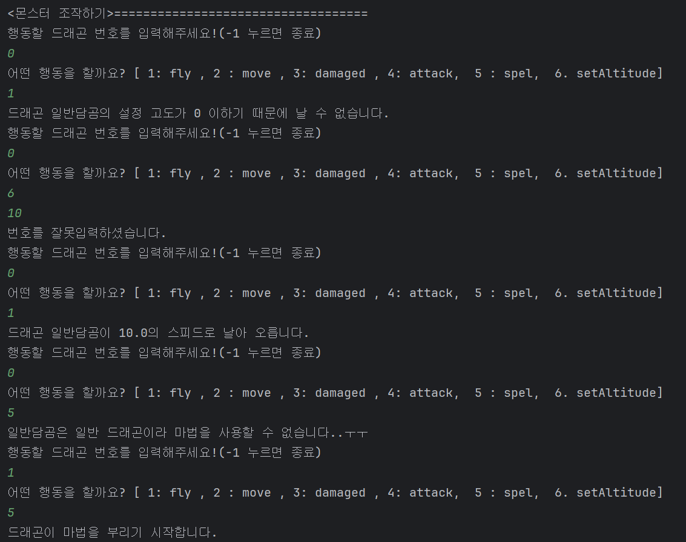

# 250509 실습 과제

## 개요
Monster Interface와 Monster들의 속성들을 정의하는 Flying, MagicCapable Interface를 만든 후 적용해보았습니다.


## 실행 결과
오늘 배운 up-casting과 down-casting을 이용해 생성된 dragon 들을 Monster 객체 배열에 저장한 후,
입력 값에 따라 해당 몬스터들이 행동하는 과정이 시각적으로 보이게 끔 코드를 작성해보았습니다!
<br>

### 1.  몬스터 생성
일반 드래곤과 마법 드래곤을 생성 할 수 있습니다.
몬스터는 Monster Interface의 정의에 따라 최대 5마리 까지 가능합니다.
```angular2html
int DEFAULT_SPAWN_LIMIT = 5;
```

<br>

### 2. 몬스터 조작
행동할 드래곤 번호와, 행동 번호를 입력해서 행동하게 할 수 있습니다.
고도를 설정하지 않으면 드래곤은 날 수 없습니다.
또한 일반 드래곤이 마법을 부리도록 하면 마법을 부릴 수 없다고 나옵니다!


<br>

몬스터가 데미지를 받아 체력이 0이 되면 죽고, 다음 번에 해당 몬스터를 선택 하면
행동을 할 수 없다고 뜹니다!!


